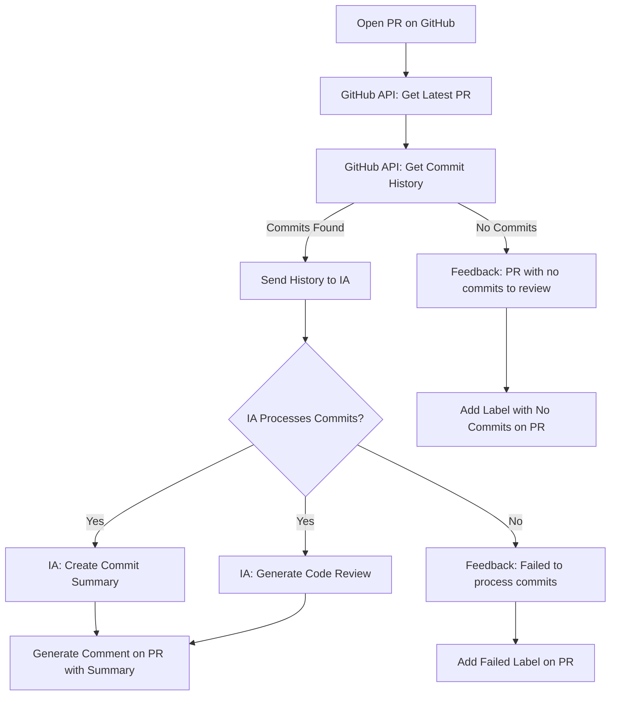

# 

# 🐙 Octopulls, this POC shows how AI acts as a reviewer.

## Why Octopulls?
#### **Efficiency in the Review Process**
- Automating the generation of code summaries and reviews can save developers and reviewers valuable time, allowing them to focus on more complex issues that require human intervention.
#### **Consistency in Reviews**
- AI can provide a level of consistency in code reviews that is difficult to achieve with reviews done exclusively by humans, especially in large teams.
#### **Continuous Learning**
- Over time, AI can be trained to identify common error patterns or poor coding practices, making it a learning tool for developers.

Feature | Availability
--- | ---
Code Review | ✅
Code Suggestion | ✅
Fine-tunning | ❌
Commit Suggestion | ❌
Code context | ❌

## Commands
Comando | Descrição
--- | ---
`npm install` | Install all dependencies
`npm run review` | Generate AI reviews of your code integrated with GitHub

## Environment variables
Variable | Description | Required
--- | --- | ---
[OPENAI_API_KEY](https://platform.openai.com/api-keys) | OpenAI API Key (ChatGPT) | ✅
[GITHUB_AUTH_TOKEN](https://github.com/settings/tokens) | GitHub Access Token for Applications | ✅
GITHUB_ORGANIZATION | Name of the organization or user who will have access to the repository for review | ✅
GITHUB_REPOSITORY | Name of the repository that will have the PRs reviewed | ✅
GITHUB_PULL_NUMBER | Pull Request number that will have the commits retrieved for review | ✅

## Product flow

